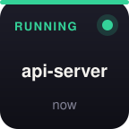
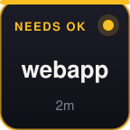
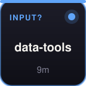
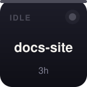
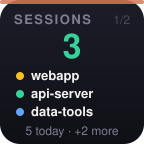
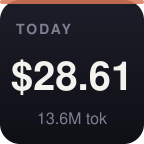
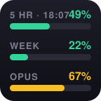

# Claude Deck

A Stream Deck plugin for **[Claude Code](https://claude.com/claude-code)**: see your sessions at a glance, jump to their terminals, approve or deny permission prompts from a key, and track usage, cost, and plan limits.

**Zero dependencies** — no `node_modules`, no build step. The plugin speaks the Stream Deck WebSocket protocol directly over `node:net`, and the Stream Deck app supplies the Node.js runtime.

<p align="center">
  
  
  
  
</p>
<p align="center">
  
  
  
  
  
</p>
<p align="center"><sub>Session states (running / needs approval / input / idle) · session list with paging · approve · deny · usage · plan limits</sub></p>

## Actions

| Key | Shows | Press |
|---|---|---|
| **Session** | One session per key: project name, state color (🟢 running / 🟠 needs approval / 🔵 waiting for input / ⚫ idle), time since activity. Place several — they fill left-to-right, approval-waiters first, then most recent. | Jump to the session's **exact terminal** — in cmux, the specific surface (split/tab) hosting that session, even when several sessions share a workspace; otherwise the Terminal.app/iTerm2 tab. If it isn't running, resume it (`claude --resume`) in a new terminal. **Long-press (0.6s) to dismiss** a session from the deck — it returns automatically on new activity. |
| **Approve** | Which session it will approve (the one waiting for permission) | Sends Enter to that session — via direct cmux surface key injection (no focus stealing) or by focusing the Terminal/iTerm tab first |
| **Deny** | Same target | Same, with Escape |
| **Active Sessions** | Prominent **active-session count**, a mini session list below it (state dot + name; bold rows = currently on your Session keys), page indicator, and today/overflow counts in the footer. | Pages the Session keys through the full list |
| **Usage** | Estimated spend + tokens from local transcripts | Cycles Today → Last 5h → Last 7 days |
| **Limits** | Your **real plan limits** (same numbers as `/usage`): 5-hour session %, weekly %, per-model weekly % as color-coded bars | Refresh now |

Idle sessions age off the deck after 24 hours (waiting ones always show). Keys refresh every 5 seconds and instantly on Claude Code notification events.

## Requirements

- macOS, Stream Deck app 6.5+
- [Claude Code](https://claude.com/claude-code) (the plugin reads its local transcripts in `~/.claude/projects`)
- Optional: [cmux](https://cmux.com) for the best experience (workspace jump + focus-free approve/deny), or Terminal.app / iTerm2
- Node.js is **not** required (dev scripts use a local Node only for icon generation and tests)

## Install

```sh
git clone <this-repo> && cd claude-deck
./install.sh
```

That's the whole setup. The installer links the plugin into Stream Deck, **installs the Claude Code Notification hook** (merged into `~/.claude/settings.json`, backup saved), **configures cmux socket access** if cmux is installed (password mode + generated password file — it asks before restarting cmux, since that closes its terminals), restarts Stream Deck, and prints a status report. It's idempotent — re-run it any time, or run `./install.sh --check` to see the status without changing anything.

Then drag actions from the **Claude Deck** category onto keys.

To remove everything, run `./uninstall.sh` — it unlinks the plugin, removes the Notification hook (preserving your other hooks, backup saved), deletes the plugin's state files (`--keep-data` to keep them), and offers to revert the cmux socket config.

The sections below document what the installer sets up, in case you prefer to do it manually or need to troubleshoot.

### Reference: "needs approval" detection

The plugin learns that a session is waiting for permission via a Claude Code [Notification hook](https://code.claude.com/docs/en/hooks) in `~/.claude/settings.json` (merged with any existing hooks):

```json
{
  "hooks": {
    "Notification": [
      {
        "hooks": [
          {
            "type": "command",
            "command": "mkdir -p ~/.claude/claude-deck; printf '{\"t\":%s,\"event\":%s}\\n' \"$(date +%s)\" \"$(cat)\" >> ~/.claude/claude-deck/events.jsonl",
            "timeout": 10
          }
        ]
      }
    ]
  }
}
```

Without the hook, session keys still work — you just won't get the amber "NEEDS OK" state or approve/deny targeting.

### Reference: cmux socket access (cmux users only)

cmux only accepts control commands from its own processes by default. The installer performs these steps; manually they are:

1. In `~/.config/cmux/cmux.json` set:
   ```json
   { "automation": { "socketControlMode": "password" } }
   ```
2. Write a password to `~/.local/state/cmux/socket-control-password`:
   ```sh
   umask 077 && openssl rand -hex 24 > ~/.local/state/cmux/socket-control-password
   ```
3. Restart cmux (the mode is read at startup).

The plugin reads the password from that file automatically. cmux injects it into its own terminals, so cmux's hooks and CLI keep working unchanged.

### macOS permissions

- **Automation** — macOS prompts when the plugin first controls Terminal/iTerm2 (not needed for cmux).
- **Accessibility** — only needed for approve/deny on plain Terminal/iTerm2 (keystroke synthesis). cmux users don't need it: keys are injected via cmux's socket API.

### Plan limits key

The Limits key reads your existing Claude Code OAuth token (macOS Keychain, read-only — the refresh token is never touched) and calls the same endpoint the `/usage` command uses. No extra setup — but if you run a per-app firewall, allow the Stream Deck plugin process to reach `api.anthropic.com:443`.

## How it works

- **Sessions and usage**: incremental parsing of Claude Code's transcripts (`~/.claude/projects/*/*.jsonl`) — token counts summed per message with request-level dedup, costs estimated from published per-MTok API pricing (cache writes at 1.25× input, cache reads at 0.1×). Costs are estimates: subscription plans don't bill per token.
- **Session → terminal mapping** is identity-first, because several sessions can share one workspace or even one directory. The session's process is identified by the `--resume <session-id>` in its argv (cwd as fallback); its cmux surface comes from the `CMUX_SURFACE_ID` environment variable cmux injects into every terminal it spawns — exact on all cmux versions, including ones that report no TTYs. Older-cmux fallbacks (per-surface resume records, TTY matching in the surface tree, surface cwd) remain behind it. In cmux the jump focuses the exact surface (`surface.focus`); plain Terminal.app/iTerm2 tabs are selected by TTY via AppleScript. All cmux handles use stable UUIDs.
- **Safety rules**: a running session is never resumed into a duplicate; keystrokes are only ever delivered to an exactly-matched surface/tab.
- **Waiting-state lifecycle**: a notification event marks a session waiting; any new transcript activity clears it.

## Development

The entry point is `com.claudedeck.plugin.sdPlugin/bin/plugin.js`; supporting modules live in `bin/lib/` (collector, terminals, cmux, limits, faces, ws). After editing, restart the Stream Deck app.

```sh
# test the data pipeline + process/cmux mapping without a Stream Deck
node com.claudedeck.plugin.sdPlugin/bin/plugin.js --test

# regenerate icons (pure-Node SDF renderer — no image libraries)
node gen-icons.mjs

# regenerate the README's example images from the real face renderer
node gen-docs.mjs
```

Runtime log: `com.claudedeck.plugin.sdPlugin/logs/claude-deck.log`

## Privacy

Everything is local. The only network call is the optional Limits key hitting Anthropic's usage endpoint with your existing local OAuth token. Nothing else leaves your machine.

## License

MIT
